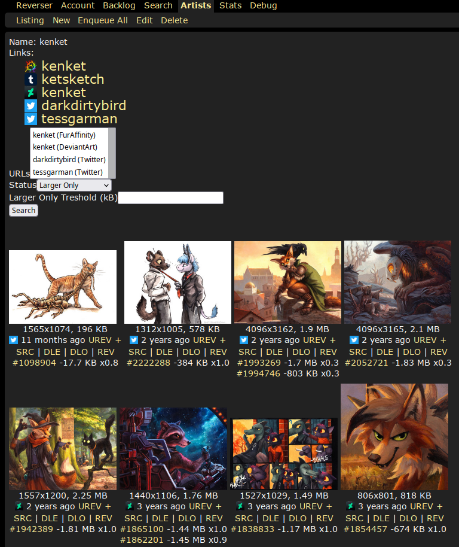
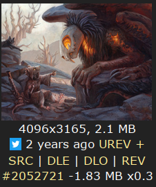
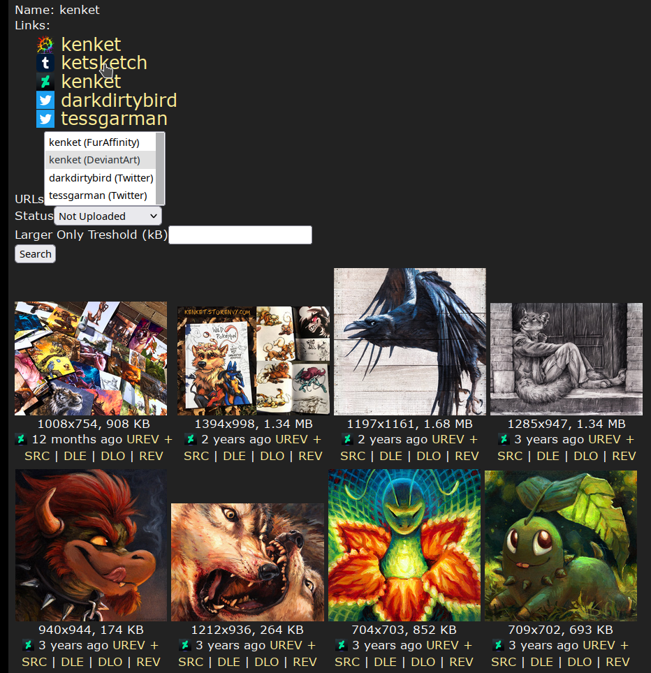

# Reverser

A content aggregator for a variety of sites to make uploading to e6 easier. Created because Saucenao doesn't support all the sites I want it to.

You provide links where the artist is uploading their content to. The content will then be scraped of those sites and put into iqdb (a reverse image search software). It also checks e6' version of iqdb to provide you information on if submissions are already uploaded, or if the current upload has a better version available elsewere.

Image dimensions and filesize are displayed, links to the original submission, the direct link of the downloaded file, and a link to start reverse image search for similar already scraped files.

The current upload on e6 is only 0.3x of the dimensions from the twitter post. It's also 1.83MB larger, a prime example for replacement. Please check manually if the file is actually superior, just because the filessize is greater doesn't mean that the visual quality is too. 

You can also search for non-uploaded submission for artists. How well this works depends on the artist and page. Some artists don't seperate their personal and art accounts and post irrelevant content which would also appear in this list.

## Limitations

E6 is limiting iqdb to one call per two seconds, which means that you will need to potentially wait for hours just to process a single artist. Until this is fixed actual usage for more than one user isn't really feasable. See [zwagoth/e621ng#368](https://github.com/zwagoth/e621ng/pull/368) for a first step to solve this problem.

## Currently supported sites
* Artstation
* Deviantart
* Furaffinity
* FurryNetwork
* Inkbunny
* Newgrounds
* Pixiv
* Reddit
* Sofurry
* Twitter
* Weasyl

## Development Setup
The following software is required to get started:
 * Latest version of Docker ([download](https://docs.docker.com/get-docker))
 * Latest version of Docker Compose ([download](https://docs.docker.com/compose/install))
 * Git ([download](https://git-scm.com/downloads))

1. Clone the repo with `git clone https://github.com/earlopain/reverser.git`.
2. `cd` into the repo.
3. Run `docker-compose up`. The container is now available at `http://localhost:9000`, but a few things still need to be done. 
4. Get inside the container with `docker-compose run reverser sh`.
5. Run `bin/rails assets:generate_spritemap` and `bin/rails db:seed` to stitch the favicons into one image and create the admin user respectively. The admin login credentials are `admin:test123`.

A few scraper require credentials to work. Create a file named `custom_config.yml` and overwrite the values specified in `data.yml`. The location of `custom_config.yml` can be set with the `REVERSER_CUSTOM_CONFIG_PATH` environment variable.
