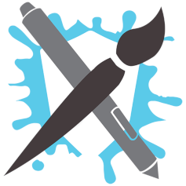
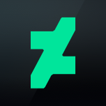
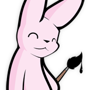
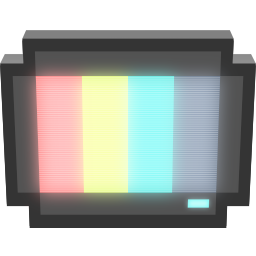

# Reverser

A content aggregator for a variety of sites to make uploading to e6 easier. Created because Saucenao doesn't support all the sites I want it to.

You provide links where the artist is uploading their content to. The content will then be scraped of those sites and put into iqdb (a reverse image search software). It also checks e6' version of iqdb to provide you information on if submissions are already uploaded, or if the current upload has a better version available elsewere.

It's also useful to clean up `source:none artist_name` searches.

Image dimensions and filesize are displayed, links to the original submission, the direct link of the downloaded file, and a link to start reverse image search for similar already scraped files.

The current upload on e6 is only 0.3x of the dimensions from the twitter post. It's also 1.83MB larger, a prime example for replacement. Please check manually if the file is actually superior, just because the filessize is greater doesn't mean that the visual quality is too. 

You can also search for non-uploaded submission for artists. How well this works depends on the artist and page. Some artists don't seperate their personal and art accounts and post irrelevant content which would also appear in this list.

## Currently supported sites
<!--- Automatically linted. You can add notes in brackets (see tumblr) -->
<!--- sites:start -->
*  Art Fight
*  Artconomy
*  ArtStation
*  Baraag
*  Bluesky
*  Commishes
*  DeviantArt
*  FurAffinity
*  FurryNetwork
*  Inkbunny
*  Itaku
*  Newgrounds
*  Omorashi
*  Pawoo
*  Piczel
*  Pixiv
*  Reddit
*  Sofurry
*  Tumblr ([see notes](#tumblr))
*  Twitter
*  Weasyl
<!--- sites:stop -->

### Tumblr

Tumblr doesn't expose the full resolution image through normal means. Getting full resolution on tumblr is a bit more compicated. Here's what you need to do, and what is done for you. Manual steps are marked with (*)
1. Reblog every post of the blog
1. (*) Download an archive of your blog
1. (*) Upload the archive through the "Archive Importer"
1. (*) Remove drafts from your blog with the [Mega-Editor](https://www.tumblr.com/mega-editor/draft/)
1. Import full resolution files from the uploaded archive

The first step starts when you add a tumblr url to an artist. Instead of downloading the image like all other scrapers, it reblogs them.

## Captchas

A few sites throw captchas at you when trying to login through an automated browser. You will need to solve these captchas manually. Click on the `Selenium` link and connect to see what is happening inside the automated browser. Solve captchas as needed when adding artist urls or enqueuing new updates.

## Configuration

A few scraper require credentials to work, you can configure them through the web UI under the `Config` header link.

## How do I actually use this?
The following software is required to get started:
 * Latest version of Docker ([download](https://docs.docker.com/get-docker))
 * Latest version of Docker Compose ([download](https://docs.docker.com/compose/install))
 * Git ([download](https://git-scm.com/downloads))

### Windows users

Install a WSL distribution, enable WSL2, and clone the project inside there. Executing docker inside WSL will still work, without directly accessing the host filesystem. This will give you a significant performance boost.

### Installation

1. Clone the repo with `git clone https://github.com/earlopain/reverser.git`.
1. `cd` into the repo.
1. `cp .env.sample .env` and fill out the necessary environment variables.
1. Build the docker image with `docker compose build`.
1. Run `docker compose run --rm reverser bin/setup`.
1. Run `docker compose up`. The container is now available at `http://localhost:9000`. A few config options are mandatory, you will be notified of them when accessing the site. See [Configuration](#configuration) on how to set them.

This project is only meant to run locally on your machine. You may host it somewhere and make it accessible to others, but be aware that there are no user accounts or fine grained permissions. Everyone can do anyhting.

### Development tools

The compose file contains services to easily run some developments tools:
* `docker compose run --rm tests`
* `docker compose run --rm rubocop`

You can pass addition parameters like individual test files or `-a` for rubocop simply by appending it to the command. I suggest you make an alias for these. You may also run these commands locally, since docker does add a fair bit of startup overhead.
